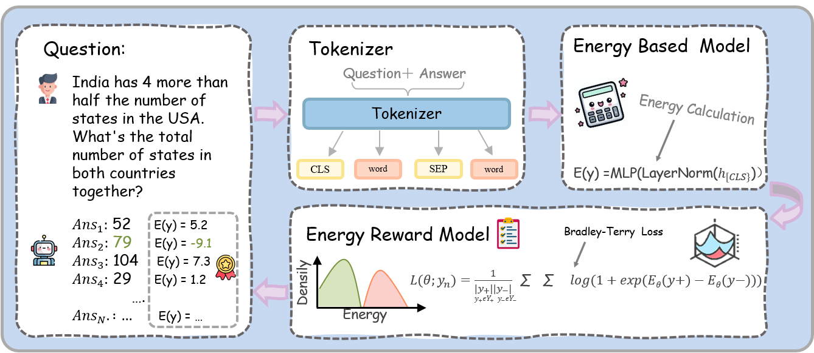

# Energy Outcome Reward Model (EORM) - Demo

## Overview

This repository provides a demonstration of the **Energy Outcome Reward Model (EORM)**, a novel approach for ranking and evaluating Chain-of-Thought (CoT) reasoning in language models. The EORM framework leverages an Energy-Based Model (EBM) to assign a scalar energy score to question-answer pairs, where lower energy indicates a higher quality (more likely correct) CoT.

The core idea is to train this EBM using outcome supervision, where the model learns to differentiate between correct and incorrect reasoning paths. The Bradley-Terry loss function is employed as the objective for this reward-based fine-tuning, enabling the model to learn a preference for CoTs that lead to correct outcomes.

Once trained, the EORM can be deployed to:
* **Rank multiple CoT generations:** Given several reasoning paths for the same question, the EORM can identify the most promising one.
* **Act as a reward signal:** The energy scores can be used to further fine-tune generator models.
* **Improve classification/selection tasks:** By providing a quantitative measure of CoT quality.

The model architecture involves tokenizing the input ([cls] + question + [sep] + answer) and then processing it through a Transformer-based EBM to output a single energy value.



---
**📢 Note: Demo Version**

This repository contains a demonstration implementation accompanying the paper:
**"Learning to Rank Chain-of-Thought: An Energy-Based Approach with Outcome Supervision"**

The full codebase with more features and experiments will be released soon. Stay tuned for updates!
---

## Getting Started: Demo Instructions

Follow these steps to set up your environment and run the demo:

### 1. Create a Python Environment & Install Dependencies

First, create a new Python environment (e.g., using `conda` or `venv`). Then, install the required packages:

```bash
pip install torch>=2.0.0 transformers>=4.30.0 tqdm>=4.60.0
````

*(Ensure you have `pip` installed and your environment is activated.)*

### 2\. Prepare the Dataset Directory

Create a dedicated folder to store the demo datasets:

```bash
mkdir demo_dataset
```

### 3\. Download Demo Datasets

Download the pre-processed GSM8K training and testing datasets generated by Llama. Use the following link:

➡️ [**Download Datasets Here**](https://drive.google.com/drive/folders/1GF89TiD5pyJAZmWZJfCL44kmmp4q2dPD?usp=sharing)

Download these two files:

  * `results_gsm8k_llama_train_n4_temp0.7_p0.9_train_corrected.jsonl`
  * `results_gsm8k_llama_test_n4_temp0.7_p0.9_test_corrected.jsonl`

Place both downloaded `.jsonl` files into the `demo_dataset` folder you created in the previous step.

### 4\. Train the Energy-Based Model (EBM)

Now, you can train the EORM. Run the `step1_train_ebm.py` script with the specified parameters:

```bash
python step1_train_ebm.py \
    --embed_dim 768 \
    --n_layers 2 \
    --n_heads 4 \
    --dropout 0.2 \
    --tok "gpt2" \
    --max_length 2048 \
    --epochs 20 \
    --bsz 1 \
    --lr 5e-5 \
    --fp16 \
    --device "auto" \
    --validate_every 1 \
    --weight_decay 0.01 \
    --warmup_ratio 0.1 \
    --num_workers 2 \
    --save_prefix "ebm_llama_gsm"
```

This command will train the model and save the trained weights (e.g., `ebm_llama_gsm_model.pt`) and tokenizer configuration.

### 5\. Test the Trained EBM

After training is complete, you can evaluate the performance of your EORM on the test set using the `step2_test_result.py` script:

```bash
python step2_test_result.py \
    --test_llama_gsm_data "demo_dataset/results_gsm8k_llama_test_n4_temp0.7_p0.9_test_corrected.jsonl" \
    --model_path "ebm_llama_gsm_model.pt" \
    --tokenizer_path "gpt2" \
    --embed_dim 768 \
    --n_layers 2 \
    --n_heads 4 \
    --dropout 0.2 \
    --max_length 2048 \
    --bsz 1 \
    --fp16 \
    --device "auto" \
    --num_workers 2
```

This will load your trained model and tokenizer, run inference on the test data, and output evaluation metrics.

-----

Feel free to experiment with the hyperparameters and explore the codebase\!

